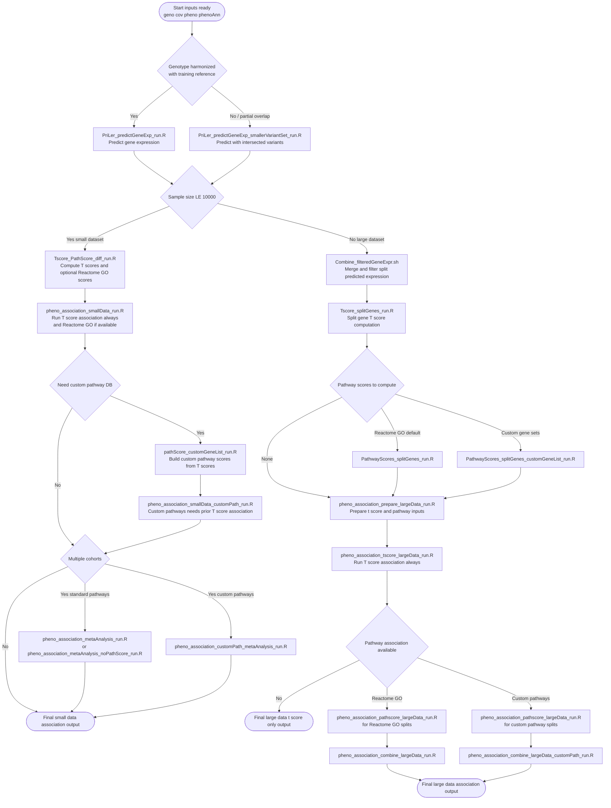

# CASTom-iGEx Module 2 Workflow

Decision-tree DAG for `Software/model_prediction` to help choose the correct script path.

## Decision-tree DAG

## Quick run checklist

- Confirm genotype/covariate/phenotype files follow naming and required columns from `README.md`.
- Choose prediction script:
  - harmonized variants -> `PriLer_predictGeneExp_run.R`
  - non-harmonized or intersected variants -> `PriLer_predictGeneExp_smallerVariantSet_run.R`
- Choose branch by cohort size:
  - small (`<= 10,000`) -> compute T scores then run `pheno_association_smallData_run.R` first
  - large (`> 10,000`) -> always run split T score association first, then optional pathway association
- Reactome and GO are the default pathway set when provided; custom pathways are optional and additive.
- If using custom pathways in small-data mode, run `pheno_association_smallData_customPath_run.R` only after T-score association is complete.
- If using custom pathways in large-data mode, use the `*_customPath*` or `*_customGeneList*` scripts at the marked DAG nodes.
- If multiple cohorts are analyzed in small-data mode, run the matching meta-analysis script.

## Main outputs at a glance

- Predicted expression: `predictedExpression.txt.gz`
- T-scores: `predictedTscores.txt` (small) or split `predictedTscore_splitGenes*.RData` (large)
- Pathway scores: Reactome/GO or custom pathway score files
- Final association outputs: `pval_*` `.RData` files (small/large/custom/meta)
